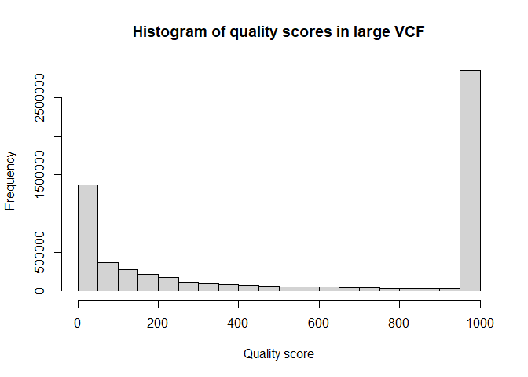
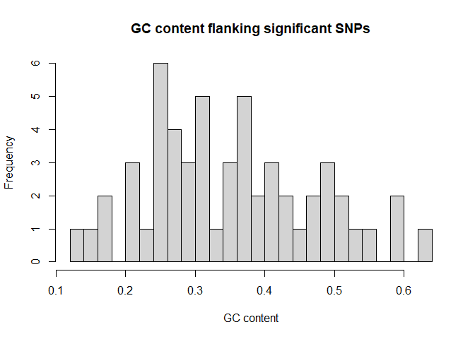
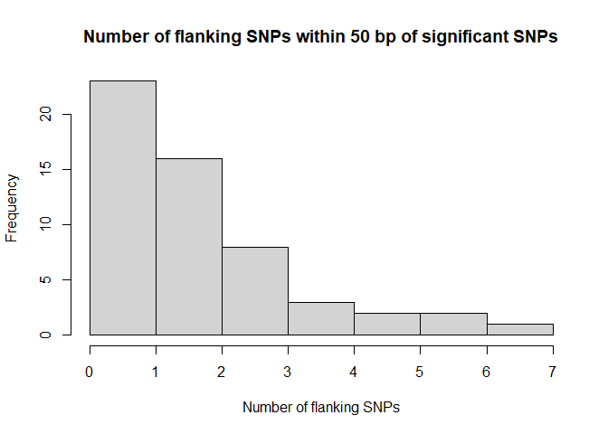
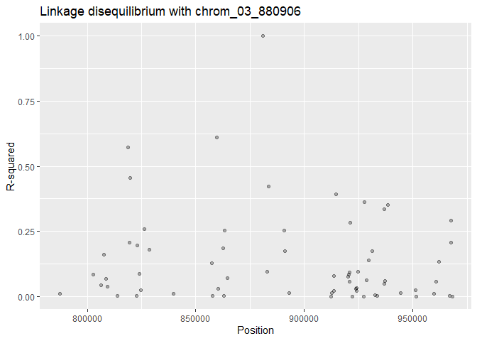
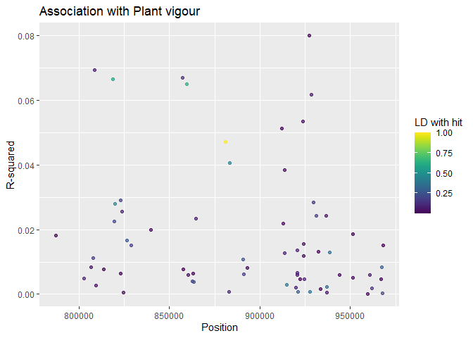

Selecting markers for marker-assisted selection
================
Lindsay Clark, HPCBio, Roy J. Carver Biotechnology Center, University of
Illinois, Urbana-Champaign
October 2020

## Setup

Be sure you have completed the [setup](Setup.md) steps before working
through this pipeline. First we’ll load all the needed packages and
functions.

``` r
library(VariantAnnotation)
library(Rsamtools)
library(ggplot2)
library(viridis)
library(dplyr)
source("src/marker_stats.R")
source("src/getNumGeno.R")
source("src/qtl_markers.R")
```

Below are names of genomics files. Edit these to match your file names.

``` r
bg <- "data/unique_173_clones.recode.vcf.bgz"
rds <- "data/yam336.m2M2vsnps_missing0.9.recode.rds" # unfiltered markers; optional
refgenome <- FaFile("data/TDr96_F1_v2_PseudoChromosome.rev07.fasta")
```

## Data import

### Significant SNPs

We will import a spreadsheet listing markers of interest. I reformatted
the Excel file that was provided to make it more compatible with R.
(I.e., deleted all header rows aside from the top one, deleted empty
rows, merged multiple rows belonging to the same marker, listed trait in
each row.)

``` r
yam_qtl <- read.csv("data/yam_qtl.csv", stringsAsFactors = FALSE)

str(yam_qtl)
```

    ## 'data.frame':    55 obs. of  4 variables:
    ##  $ Marker  : chr  "chrom_03_880906_G" "chrom_11_1819621_T" "chrom_01_7175652_A" "chrom_11_93339_A" ...
    ##  $ Chr     : int  3 11 1 11 11 11 11 11 11 11 ...
    ##  $ Position: int  880906 1819621 7175652 93339 222725 260263 278178 353466 553347 555279 ...
    ##  $ Trait   : chr  "Plant vigour" "Plant sex" "Plant sex" "Flowering intensity" ...

We will make a chromosome column to match the chromosome names in the
FASTA and VCF files. We’ll also make a marker name column with the
allele trimmed off.

``` r
yam_qtl$Chromosome <- sub("_[[:digit:]]+_[ACGT]$", "", yam_qtl$Marker)
yam_qtl$Marker_short <- sub("_[ACGT]$", "", yam_qtl$Marker)
head(yam_qtl)
```

    ##               Marker Chr Position               Trait Chromosome     Marker_short
    ## 1  chrom_03_880906_G   3   880906        Plant vigour   chrom_03  chrom_03_880906
    ## 2 chrom_11_1819621_T  11  1819621           Plant sex   chrom_11 chrom_11_1819621
    ## 3 chrom_01_7175652_A   1  7175652           Plant sex   chrom_01 chrom_01_7175652
    ## 4   chrom_11_93339_A  11    93339 Flowering intensity   chrom_11   chrom_11_93339
    ## 5  chrom_11_222725_C  11   222725 Flowering intensity   chrom_11  chrom_11_222725
    ## 6  chrom_11_260263_C  11   260263 Flowering intensity   chrom_11  chrom_11_260263

### Phenotypes

We can read in phenotype data so that we can see how well SNPs predict
phenotypes.

``` r
pheno <- read.csv("data/pheno_data all 174.csv")
head(pheno)
```

    ##                                                                                                 Clones    DRS     Name Stem_diameter_2017_2018 YMV_2017_2018
    ## 1 /home/ibrcuser/work/plant2/2019_Yam/1200.PCflye_ac334_ns167_align/PCrev6_all_bams/DRS_002.all.rd.bam DRS002 TDr1489A                   3.833             3
    ## 2 /home/ibrcuser/work/plant2/2019_Yam/1200.PCflye_ac334_ns167_align/PCrev6_all_bams/DRS_003.all.rd.bam DRS003 TDr2284A                   2.421             3
    ## 3 /home/ibrcuser/work/plant2/2019_Yam/1200.PCflye_ac334_ns167_align/PCrev6_all_bams/DRS_004.all.rd.bam DRS004 TDr1499A                   5.037             3
    ## 4 /home/ibrcuser/work/plant2/2019_Yam/1200.PCflye_ac334_ns167_align/PCrev6_all_bams/DRS_006.all.rd.bam DRS006 TDr1509A                   4.290             3
    ## 5 /home/ibrcuser/work/plant2/2019_Yam/1200.PCflye_ac334_ns167_align/PCrev6_all_bams/DRS_007.all.rd.bam DRS007 TDr1510A                   4.452             3
    ## 6 /home/ibrcuser/work/plant2/2019_Yam/1200.PCflye_ac334_ns167_align/PCrev6_all_bams/DRS_009.all.rd.bam DRS009 TDr3782A                   3.175             2
    ##   YAD_2017_2018 Plant_vigour_2017_2018 Plant_sex_2017_2018 Yield_plant_2017_2018 Tuber_appearance_2017_2018 Spines_on_tuber_2017_2018 Tuber_cracks_2017_2018
    ## 1             2                      2                   2                 1.068                          2                         1                      2
    ## 2             2                      2                   1                 0.434                          1                         0                      1
    ## 3             2                      2                   3                 1.754                          2                         1                      1
    ## 4             2                      2                   2                 0.530                          2                         0                      1
    ## 5             2                      2                   0                 1.199                          1                         0                      1
    ## 6             2                      2                   0                 0.645                          2                         0                      1
    ##   Tuber_hairiness_2017_2018 No_of_stems_2017_2018 Spines_on_Stem_2017_2018 oxidation_2018 Dry_matter Yield_t_ha_2017_2018 Av_tuber_wt_2017_2018
    ## 1                         3                     1                        1              3   34.77232                10.50                  0.77
    ## 2                         1                     2                        1              2   33.28557                 4.17                  0.32
    ## 3                         3                     1                        2              1   38.06997                17.43                  1.77
    ## 4                         2                     1                        2              1   35.32271                 5.18                  0.53
    ## 5                         3                     1                        1              1   35.68722                11.12                  1.07
    ## 6                         2                     1                        1              1   34.37731                 6.30                  0.61
    ##   Flowering_intensity_2017_2018 Days_to_maturity_2017_2018 No_of_tubers_2017_2018
    ## 1                          5.50                     211.25                      2
    ## 2                          2.00                     176.90                      2
    ## 3                          3.50                     200.20                      1
    ## 4                          1.50                     158.75                      1
    ## 5                          3.38                     174.35                      2
    ## 6                          2.00                     172.00                      1

The column names should be made to match the QTL spreadsheet.

``` r
traits <- unique(yam_qtl$Trait)
names(pheno)
```

    ##  [1] "Clones"                        "DRS"                           "Name"                          "Stem_diameter_2017_2018"       "YMV_2017_2018"                
    ##  [6] "YAD_2017_2018"                 "Plant_vigour_2017_2018"        "Plant_sex_2017_2018"           "Yield_plant_2017_2018"         "Tuber_appearance_2017_2018"   
    ## [11] "Spines_on_tuber_2017_2018"     "Tuber_cracks_2017_2018"        "Tuber_hairiness_2017_2018"     "No_of_stems_2017_2018"         "Spines_on_Stem_2017_2018"     
    ## [16] "oxidation_2018"                "Dry_matter"                    "Yield_t_ha_2017_2018"          "Av_tuber_wt_2017_2018"         "Flowering_intensity_2017_2018"
    ## [21] "Days_to_maturity_2017_2018"    "No_of_tubers_2017_2018"

``` r
names(pheno) <- gsub("_201[78]", "", names(pheno))
names(pheno) <- gsub("_", " ", names(pheno))
names(pheno)
```

    ##  [1] "Clones"              "DRS"                 "Name"                "Stem diameter"       "YMV"                 "YAD"                 "Plant vigour"       
    ##  [8] "Plant sex"           "Yield plant"         "Tuber appearance"    "Spines on tuber"     "Tuber cracks"        "Tuber hairiness"     "No of stems"        
    ## [15] "Spines on Stem"      "oxidation"           "Dry matter"          "Yield t ha"          "Av tuber wt"         "Flowering intensity" "Days to maturity"   
    ## [22] "No of tubers"

``` r
setdiff(traits, names(pheno))
```

    ## [1] "Number of tubers per plant" "Yield per plant"            "Spines on tuber surface"

``` r
setdiff(names(pheno), traits)
```

    ##  [1] "Clones"           "DRS"              "Name"             "Stem diameter"    "Yield plant"      "Spines on tuber"  "Tuber cracks"     "Tuber hairiness" 
    ##  [9] "No of stems"      "Spines on Stem"   "oxidation"        "Dry matter"       "Yield t ha"       "Av tuber wt"      "Days to maturity" "No of tubers"

``` r
names(pheno)[names(pheno) == "Spines on tuber"] <- "Spines on tuber surface"
names(pheno)[names(pheno) == "No of tubers"] <- "Number of tubers per plant"
names(pheno)[names(pheno) == "Yield plant"] <- "Yield per plant"

all(traits %in% names(pheno)) # should be TRUE
```

    ## [1] TRUE

### Genotypes and annotations from VCF

We will specify ranges in which we wish to look at SNPs for KASP marker
design. Let’s look within 100 kb of each significant SNP.

``` r
search_distance <- 1e5
qtl_ranges <- GRanges(yam_qtl$Chromosome,
                      IRanges(start = yam_qtl$Position - search_distance,
                              end = yam_qtl$Position + search_distance))
names(qtl_ranges) <- yam_qtl$Marker_short
```

We will import numeric genotypes just within these ranges.

``` r
numgen <- getNumGeno(bg, ranges = qtl_ranges)
str(numgen)
```

    ##  int [1:5684, 1:173] 0 1 2 2 0 1 0 0 2 2 ...
    ##  - attr(*, "dimnames")=List of 2
    ##   ..$ : chr [1:5684] "chrom_03_787284" "chrom_03_802803" "chrom_03_806513" "chrom_03_807804" ...
    ##   ..$ : chr [1:173] "DRS_002" "DRS_003" "DRS_004" "DRS_006" ...

There are 5684 markers across 173 individuals, and genotypes are coded
from zero to two. We will change the accession names to match the
phenotype spreadsheet.

``` r
if(all(sub("_", "", colnames(numgen)) %in% pheno$DRS)){
  colnames(numgen) <- sub("_", "", colnames(numgen))
}

all(colnames(numgen) %in% pheno$DRS) # should be TRUE
```

    ## [1] TRUE

We will also import SNP metadata within these ranges.

``` r
myvcf <- readVcf(bg,
                 param = ScanVcfParam(geno = NA, which = qtl_ranges))

rowRanges(myvcf)
```

    ## GRanges object with 5684 ranges and 5 metadata columns:
    ##                    seqnames    ranges strand |     paramRangeID            REF                ALT      QUAL      FILTER
    ##                       <Rle> <IRanges>  <Rle> |         <factor> <DNAStringSet> <DNAStringSetList> <numeric> <character>
    ##    chrom_03_787284 chrom_03    787284      * |  chrom_03_880906              T                  G       999           .
    ##    chrom_03_802803 chrom_03    802803      * |  chrom_03_880906              C                  T       999           .
    ##    chrom_03_806513 chrom_03    806513      * |  chrom_03_880906              C                  G       999           .
    ##    chrom_03_807804 chrom_03    807804      * |  chrom_03_880906              G                  A       999           .
    ##    chrom_03_808627 chrom_03    808627      * |  chrom_03_880906              A                  G       999           .
    ##                ...      ...       ...    ... .              ...            ...                ...       ...         ...
    ##   chrom_04_2500587 chrom_04   2500587      * | chrom_04_2412239              C                  T       999           .
    ##   chrom_04_2501766 chrom_04   2501766      * | chrom_04_2412239              C                  G       999           .
    ##   chrom_04_2503405 chrom_04   2503405      * | chrom_04_2412239              A                  C       999           .
    ##   chrom_04_2509242 chrom_04   2509242      * | chrom_04_2412239              C                  T       999           .
    ##   chrom_04_2509990 chrom_04   2509990      * | chrom_04_2412239              A                  C       999           .
    ##   -------
    ##   seqinfo: 2253 sequences from an unspecified genome

We can see that the `paramRangeID` column indicates which original
marker each SNP is near. Since there were some significant SNPs close to
each other, that also means we have some duplicates in both `numgen` and
`myvcf`.

``` r
identical(rownames(numgen), names(rowRanges(myvcf)))
```

    ## [1] TRUE

``` r
as.logical(anyDuplicated(rownames(numgen)))
```

    ## [1] TRUE

### Unfiltered VCF

In this case we had a much larger VCF with rarer SNPs, so we will import
that too.

``` r
bigvcf <- readRDS(rds)

rowRanges(bigvcf)
```

    ## GRanges object with 6095038 ranges and 5 metadata columns:
    ##                         seqnames    ranges strand | paramRangeID            REF                ALT      QUAL      FILTER
    ##                            <Rle> <IRanges>  <Rle> |     <factor> <DNAStringSet> <DNAStringSetList> <numeric> <character>
    ##      chrom_01:32610_A/T chrom_01     32610      * |           NA              A                  T  11.38340           .
    ##      chrom_01:32612_G/T chrom_01     32612      * |           NA              G                  T   9.86092           .
    ##      chrom_01:32617_A/C chrom_01     32617      * |           NA              A                  C 352.00000           .
    ##      chrom_01:32628_C/T chrom_01     32628      * |           NA              C                  T 118.00000           .
    ##      chrom_01:32656_A/G chrom_01     32656      * |           NA              A                  G 293.00000           .
    ##                     ...      ...       ...    ... .          ...            ...                ...       ...         ...
    ##   chrom_20:33018647_T/G chrom_20  33018647      * |           NA              T                  G 999.00000           .
    ##   chrom_20:33018670_A/T chrom_20  33018670      * |           NA              A                  T 352.00000           .
    ##   chrom_20:33018687_C/G chrom_20  33018687      * |           NA              C                  G 999.00000           .
    ##   chrom_20:33018902_T/C chrom_20  33018902      * |           NA              T                  C   6.42809           .
    ##   chrom_20:33018924_C/T chrom_20  33018924      * |           NA              C                  T 999.00000           .
    ##   -------
    ##   seqinfo: 2253 sequences from an unspecified genome

Since we have quality scores, we will look at the distribution.

``` r
hist(rowRanges(bigvcf)$QUAL, xlab = "Quality score",
     main = "Histogram of quality scores in large VCF")
```

<!-- -->

This suggests filtering to only keep the highest scores is advisable. We
will also make sure to keep any SNPs that were in our smaller VCF.

``` r
temp <- paste(seqnames(bigvcf), start(bigvcf), sep = "_")

bigvcf <- bigvcf[rowRanges(bigvcf)$QUAL > 900 | 
                temp %in% names(myvcf),]
rm(temp)
```

Lastly, we will filter the VCF to only contain SNPs in our QTL ranges.

``` r
bigvcf <- subsetByOverlaps(bigvcf, qtl_ranges)
```

## Technical parameters for marker design from significant SNPs

Ideally, we would like to design markers directly from the significant
hits. We should check that they will make reasonably good KASP markers
first, however.

### GC content

PCR will work best when GC content is 40-60%.

``` r
yam_qtl$GCcontent <- gcContent(myvcf, yam_qtl$Marker_short, refgenome)

hist(yam_qtl$GCcontent, xlab = "GC content",
     main = "GC content flanking significant SNPs", breaks = 20)
```

<!-- -->

Many are below the desired range, so we may see if there are any nearby
SNPs in LD that have better GC content.

### Number of flanking SNPs

A few flanking SNPs are okay, but we want to make sure none of these
have an excessive amount.

``` r
yam_qtl$Nflanking <- nFlankingSNPs(bigvcf, yam_qtl$Marker_short)

hist(yam_qtl$Nflanking, xlab = "Number of flanking SNPs",
     main = "Number of flanking SNPs within 50 bp of significant SNPs")
```

<!-- -->

``` r
table(yam_qtl$Nflanking)
```

    ## 
    ##  0  1  2  3  4  5  6  7 
    ##  9 14 16  8  3  2  2  1

For those with three or more, we might see if there are better markers.

## Evaluating nearby markers

### Finding markers in linkage disequilibrium (LD)

Below is a function that uses that information to estimate LD of every
SNP within range with the significant SNP. We will reorder the results
to match the table of significant SNPs.

``` r
ld <- LD(numgen, myvcf)
ld <- ld[yam_qtl$Marker_short]
```

Let’s also extract start positions for the sake of plotting.

``` r
snplist <- split(rowRanges(myvcf), rowRanges(myvcf)$paramRangeID)
snplist <- snplist[yam_qtl$Marker_short]
positions <- start(snplist)
```

``` r
i <- 1
ggplot(mapping = aes(x = positions[[i]], y = ld[[i]])) +
  geom_point(alpha = 0.3) +
  labs(x = "Position", y = "R-squared",
       title = paste("Linkage disequilibrium with", names(snplist)[i]))
```

<!-- -->

The actual SNP of interest shows up as 100% LD in the middle of the
range. There are a few nearby around 50% LD, which is not great but we
might consider those if the SNP of interest is in a very low GC region,
for example.

### Finding markers correlating with the trait

For all markers nearby to our significant SNPs, let’s also look at the
R-squared with the corresponding trait.

``` r
phen_rsq <- phenoCorr(numgen, myvcf, yam_qtl$Marker_short, yam_qtl$Trait,
                      pheno) ^ 2
```

    ## Warning in cor(traittab[[traits[i]]], numgen[x, ], use = "pairwise.complete.obs", : the standard deviation is zero
    
    ## Warning in cor(traittab[[traits[i]]], numgen[x, ], use = "pairwise.complete.obs", : the standard deviation is zero
    
    ## Warning in cor(traittab[[traits[i]]], numgen[x, ], use = "pairwise.complete.obs", : the standard deviation is zero
    
    ## Warning in cor(traittab[[traits[i]]], numgen[x, ], use = "pairwise.complete.obs", : the standard deviation is zero
    
    ## Warning in cor(traittab[[traits[i]]], numgen[x, ], use = "pairwise.complete.obs", : the standard deviation is zero

``` r
phen_rsq <- phen_rsq[yam_qtl$Marker_short]
```

``` r
ggplot(mapping = aes(x = positions[[i]], y = phen_rsq[[i]],
                     color = ld[[i]])) +
  geom_point(alpha = 0.7) +
  labs(x = "Position", y = "R-squared",
       title = paste("Association with", yam_qtl$Trait[i]),
       color = "LD with hit") +
  scale_color_viridis()
```

<!-- -->

## Choosing markers to output

We may want to output a table of the best markers, along with some
statistics so that we can manually choose among them. Let’s take the top
ten R-squared values for association with the trait of interest, and
also make sure to get the significant SNP itself.

``` r
n <- 10 # edit this number if you want to keep a different number of markers

top10 <- lapply(phen_rsq, function(x){
  x1 <- sort(x, decreasing = TRUE)
  if(length(x1) > n){
    x1 <- x1[1:n]
  }
  return(names(x1))
} ) ### edit this to always nab the qtl

top10tab <- utils::stack(top10)
colnames(top10tab) <- c("SNP_ID", "QTL")

# Add in any QTL that weren't in top 10 associated SNPs
toadd <- setdiff(yam_qtl$Marker_short, top10tab$SNP_ID)
top10tab <- rbind(top10tab,
                  data.frame(SNP_ID = toadd, QTL = toadd))
top10tab <- top10tab[order(factor(top10tab$QTL, levels = yam_qtl$Marker_short)),]
```

Now we’ll get the KASP-formatted sequence for these markers.

``` r
outtab <- formatKasp(bigvcf, top10tab$SNP_ID, refgenome)
outtab <- cbind(outtab, top10tab[,"QTL", drop = FALSE])
```

We’ll add in linkage disequilibrium and trait association data, and also
mark which allele was positively associated with the trait.

``` r
extr <- function(x, y, lst){
  return(lst[[x]][y])
}
outtab$LD_with_QTL <- mapply(extr, outtab$QTL, outtab$SNP_ID, MoreArgs = list(ld))
outtab$R2_with_trait <- mapply(extr, outtab$QTL, outtab$SNP_ID, MoreArgs = list(phen_rsq))

als <- whichAlleleList(numgen, myvcf, yam_qtl$Marker_short, yam_qtl$Trait,
                       pheno)
```

    ## Warning in cor(traittab[[traits[i]]], numgen[x, ], use = "pairwise.complete.obs", : the standard deviation is zero
    
    ## Warning in cor(traittab[[traits[i]]], numgen[x, ], use = "pairwise.complete.obs", : the standard deviation is zero
    
    ## Warning in cor(traittab[[traits[i]]], numgen[x, ], use = "pairwise.complete.obs", : the standard deviation is zero
    
    ## Warning in cor(traittab[[traits[i]]], numgen[x, ], use = "pairwise.complete.obs", : the standard deviation is zero
    
    ## Warning in cor(traittab[[traits[i]]], numgen[x, ], use = "pairwise.complete.obs", : the standard deviation is zero

``` r
outtab$Pos_allele <- mapply(function(x, y, ...) as.character(extr(x, y, ...)), outtab$QTL, outtab$SNP_ID, MoreArgs = list(als))
```

We will also add the GC content and number of flanking SNPs.

``` r
outtab$GC_content <- gcContent(myvcf, outtab$SNP_ID, refgenome)
outtab$N_flanking <- nFlankingSNPs(bigvcf, outtab$SNP_ID)

head(outtab)
```

    ##            SNP_ID                                                                                                Sequence             QTL  LD_with_QTL R2_with_trait
    ## 1 chrom_03_927345 GATGGCGATGAAAACCAAATACCCGAATTTTATATTCAAAATCGTGTGCT[Y]GTTTATTTAGCTAAWTTTTTTAACACCCAATAATTTTTTGCCTACTGAGG chrom_03_880906 0.0002381184    0.08001374
    ## 2 chrom_03_808627 GACCCYGCCACTTCCCGCATTGTTGCCACCGGATCCGTCTTCATTGAGAA[R]AAGTTCATCCRRGGTTGCTCCAGTGTCGGCCACATCGAGGACGTCGTTGT chrom_03_880906 0.0662708530    0.06937250
    ## 3 chrom_03_857437 GAAAAATCATAGACTCACAGTTAWCCGTAAAAAAAATTCTAAAACTTTCT[W]TAAAAAAATCTCTTGAATCTAAAATAGAAAGCAAACCTTCTCTGTCAAAA chrom_03_880906 0.1269848845    0.06712568
    ## 4 chrom_03_818630 ACTAAATATAATATTTAGGACTATCATTTTCAAATGGCTTATTTGTTCCT[R]AATGATTAATTTTTTGATAATTATTTATATTTGGCTTACTAATTAATATT chrom_03_880906 0.5718231650    0.06656723
    ## 5 chrom_03_859550 TACATTCACTCYATGGAAAGATCACAAAAAATGAAGTAATGCACACACAM[M]CACGCTAGATCATACACATTTGGCAAAACTCAATAGTTCTACTACCCTAA chrom_03_880906 0.6119078637    0.06512163
    ## 6 chrom_03_928653 CTTGCACATGCTATTGTTGAGCCAAATAGAAAATTCCATAAAAGCCCTTC[M]WTTCCATTCCATTGCTTGTATCCCTCCTCCGCCGCCTCCTTGCTCCTCYT chrom_03_880906 0.0625232930    0.06184332
    ##   Pos_allele GC_content N_flanking
    ## 1          C  0.3267327          1
    ## 2          A  0.5643564          3
    ## 3          A  0.2574257          1
    ## 4          A  0.1881188          0
    ## 5          C  0.3663366          2
    ## 6          C  0.4752475          2

Now we have a data frame that we can export to a spreadsheet, and we can
manually select SNPs for development as KASP markers. I recommend
selecting the SNP matching the QTL, plus one or two more SNPs that are
similarly associated with the trait and have as close to optimal GC
content as possible.

``` r
write.csv(outtab, file = "results/mas_markers.csv", row.names = FALSE)
```
