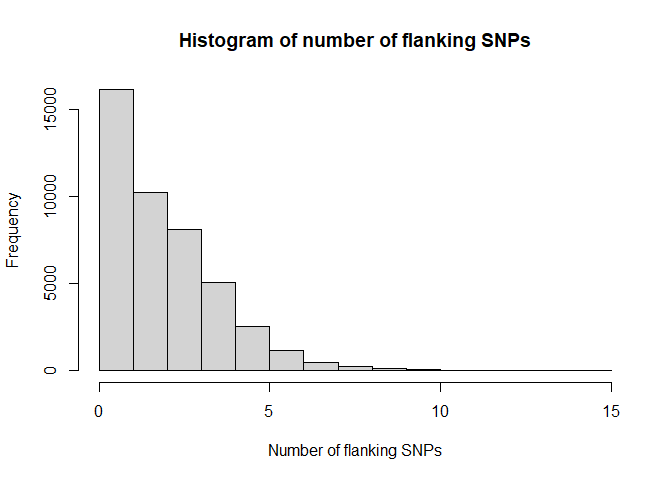

Selecting markers for pedigree verification
================
Lindsay Clark, HPCBio, Roy J. Carver Biotechnology Center, University of
Illinois, Urbana-Champaign

In this workflow, we’ll identify markers useful for identifying
accessions and verifying pedigrees, and export those markers for KASP
marker design.

## Setup

Be sure you have completed the [setup](Setup.md) steps before working
through this pipeline. First we’ll load all the needed packages and
functions.

``` r
library(VariantAnnotation)
library(Rsamtools)
library(adegenet)
library(ggplot2)
library(ape)
library(dplyr)
source("src/marker_stats.R")
source("src/getNumGeno.R")
source("src/evaluate_marker_sets.R")
```

Next we’ll point to our VCF and reference genome files. Edit these lines
to point to your dataset.

``` r
bg <- "data/331_new_data_vcf_IBRC.vcf.bgz"
refgenome <- FaFile("data/TDr96_F1_v2_PseudoChromosome.rev07.fasta")
```

## Population statistics

We’ll import all the genotypes in numeric format, indicating number of
copies of the alternative allele.

``` r
numgen <- getNumGeno(bg)
numgen[1:10,1:10]
```

    ##                 TDr2946A TDr1489A TDr2284A TDr1499A TDr1509A TDr1510A TDr3782A TDr1858C TDr1576A TDr1585A
    ## chrom_01_32840         0        0        0        0        1        0        0        0        1        0
    ## chrom_01_45700         0        1        1        0        1        0        1        0        1        1
    ## chrom_01_58956         0        0        0        1        0        1        1        0        0        1
    ## chrom_01_62865         1        1        2        1        1        1        1        1        1        1
    ## chrom_01_65124         0        1        1        0        1        1        1        0        1        1
    ## chrom_01_66753         0        0        0        0        0        1        0        0        0        0
    ## chrom_01_115638        0        0        0        0        1        0        1        0        0        0
    ## chrom_01_117893        1        1        0        1        0        0        0        0        0        0
    ## chrom_01_119536        1        0        1        0        0        1        1        2        1        1
    ## chrom_01_129906        1        0        0        1        1        0        0        1        0        0

### Check for clonal duplicates

It is good to check that there aren’t any clonal duplicates in the
dataset, as these could bias downstream analysis. We’ll calculate
inter-individual distances and look at the distribution of those
distances.

``` r
mydist <- interIndividualDist(numgen)

hist(mydist, xlab = "Euclidian distance", main = "Histogram of inter-individual distances")
```

<!-- -->

``` r
plot(nj(mydist), type = "unrooted", show.tip.label = FALSE)
```

<!-- -->

Here it looks like the most closely related individuals are family
members, not clones. If there were some values closer to zero, however,
clones could be removed using the `removeClones` function.

``` r
numgen <- removeClones(numgen, mydist)
```

### Observed and expected heterozygosity

Let’s look at the distribution of allele frequencies in this dataset.

``` r
alfreq <- rowMeans(numgen, na.rm = TRUE) / 2
hist(alfreq, xlab = "Allele frequency", main = "Histogram of alternative allele frequency")
```

<!-- -->

We can look at the relationship between observed and expected
heterozygosity ( *Ho* and *He*, respectively).

``` r
He <- Expected_het(alfreq)
Ho <- rowMeans(numgen == 1, na.rm = TRUE)
hist(Ho / He)
```

<!-- -->

In this case the mode is a little above 1, suggesting the presence of
hybrid lines and/or polyploids in the dataset. The bump at 2 indicates
likely paralogs. In this case we’ll set a cutoff at 1.5.

``` r
hohe_cutoff <- 1.5

ggplot(mapping = aes(x = alfreq, y = Ho/He)) +
  geom_point(alpha = 0.05) +
  geom_hline(yintercept = hohe_cutoff, color = "blue") +
  labs(x = "Allele frequency") +
  ggtitle("Filtering for putative paralogs")
```

<!-- -->

We can see what proportion of markers we would lose at this cutoff, It’s
about 11%.

``` r
mean(Ho/He > hohe_cutoff)
```

    ## [1] 0.110541

We’ll do that filtering now, then start a data frame to track statistics
about each SNP.

``` r
keep1 <- which(Ho/He < hohe_cutoff)

numgen <- numgen[keep1,]
snpdf <- data.frame(row.names = rownames(numgen),
                    AlFreq = alfreq[keep1],
                    Ho = Ho[keep1],
                    He = He[keep1])
```

In this case there are no missing data, but I am going to add that
calculation in for the sake of reusing the workflow.

``` r
snpdf$MissingRate <- rowMeans(is.na(numgen))
summary(snpdf)
```

    ##      AlFreq              Ho                He          MissingRate
    ##  Min.   :0.09366   Min.   :0.03021   Min.   :0.1698   Min.   :0   
    ##  1st Qu.:0.14199   1st Qu.:0.26284   1st Qu.:0.2437   1st Qu.:0   
    ##  Median :0.20695   Median :0.35650   Median :0.3282   Median :0   
    ##  Mean   :0.24192   Mean   :0.37814   Mean   :0.3388   Mean   :0   
    ##  3rd Qu.:0.31873   3rd Qu.:0.48036   3rd Qu.:0.4343   3rd Qu.:0   
    ##  Max.   :0.50000   Max.   :0.74924   Max.   :0.5000   Max.   :0

We can also look at the heterozygosity across individuals. The two
outlier individuals we see below are likely to be polyploids or
inter-species hybrids. We’ll filter them out.

``` r
hetByInd <- colMeans(numgen == 1, na.rm = TRUE)
hist(hetByInd)
```

<!-- -->

``` r
numgen <- numgen[, hetByInd < 0.5]
```

## Genetic groups

We could simply choose markers with high allele frequency at this point,
but instead I am going to identify genetic groups first. That way, I can
test the allele frequency within each genetic group. We generally want a
variety of markers so that we have some that are variable within each
group, and some that can distinguish groups. We’ll use the Discriminant
Analysis of Principal Components (DAPC) protocol implemented in the
`adegenet` package. In order to knit this document I have to set
`n.pca`, `n.clust`, and `n.da` manually, but for your work I recommend a
first pass where they are left as `NULL` so that you can chose them
based on where the graphs plateau.

``` r
myclust <- find.clusters(t(numgen), n.pca = 100, n.clust = 10)
```

Check the size of the groups. If it is very uneven, you may want fewer
groups.

``` r
myclust$size
```

    ##  [1] 40 39 45 28 47 33 12 24 29 32

Now perform DAPC.

``` r
mydapc <- dapc(t(numgen), grp = myclust$grp, scale = TRUE, n.pca = 50, n.da = 2)
```

``` r
scatter(mydapc, posi.da = "topright")
```

<!-- -->

Group assignments are in `mydapc$assign`. You many want to inspect some
of the more differentiated groups to see if they are biologically
meaningful.

``` r
colnames(numgen)[mydapc$assign == 9]
```

    ##  [1] "TDr2946A"   "TDr1655A"   "TDr1850A"   "TDr2674A"   "TDr2948A"   "TDr2965A"   "TDr3527A"   "TDr3624B"   "TDr3828B"   "TDr2090B"   "TDr4100A"   "TDr4180A"  
    ## [13] "TDr2262"    "TDr1717"    "TDr1763"    "TDr2502"    "TDr2674"    "TDr2965"    "TDr3408"    "TDr1905"    "TDr1928"    "TDr2048"    "TDr2564"    "TDr3006"   
    ## [25] "TDr1956"    "TDr0801090" "TDr3338"    "TDr3643"    "TDr4100"

``` r
colnames(numgen)[mydapc$assign == 4]
```

    ##  [1] "TDr1598A" "TDr1775A" "TDr1807A" "TDr2155A" "TDr2161C" "TDr2167A" "TDr2427B" "TDr2554A" "TDr4067A" "TDr3519A" "TDr1615"  "TDr1769"  "TDr1876"  "TDr2015" 
    ## [15] "TDr2028"  "TDr2110"  "TDr2681"  "TDr2973"  "TDr3519"  "TDr3579"  "TDr3592"  "TDr1958"  "TDr2249"  "TDr2297"  "TDr2355"  "TDr2974"  "TDr2975"  "TDr2859"

Now we can get allele frequencies within each genetic group.

``` r
grp_alfreq <- sapply(levels(mydapc$assign),
                     function(x) rowMeans(numgen[, mydapc$assign == x], na.rm = TRUE) / 2)
colnames(grp_alfreq) <- paste0("AlFreq_Grp", colnames(grp_alfreq))
head(grp_alfreq)
```

    ##                 AlFreq_Grp1 AlFreq_Grp2 AlFreq_Grp3 AlFreq_Grp4 AlFreq_Grp5 AlFreq_Grp6 AlFreq_Grp7 AlFreq_Grp8 AlFreq_Grp9 AlFreq_Grp10
    ## chrom_01_32840   0.36666667      0.4375  0.30000000  0.26785714   0.2448980        0.20  0.35714286     0.09375  0.24137931   0.11842105
    ## chrom_01_45700   0.61111111      0.5000  0.50000000  0.48214286   0.4081633        0.32  0.39285714     0.09375  0.27586207   0.21052632
    ## chrom_01_58956   0.05555556      0.0250  0.06666667  0.03571429   0.1938776        0.12  0.03571429     0.21875  0.15517241   0.11842105
    ## chrom_01_65124   0.62222222      0.4875  0.51111111  0.50000000   0.4081633        0.40  0.35714286     0.09375  0.27586207   0.28947368
    ## chrom_01_66753   0.07777778      0.0250  0.17777778  0.05357143   0.1224490        0.30  0.07142857     0.12500  0.01724138   0.23684211
    ## chrom_01_115638  0.36666667      0.3625  0.28888889  0.30357143   0.1938776        0.22  0.17857143     0.06250  0.24137931   0.09210526

## Technical parameters

For this portion of the workflow, we’ll import SNP metadata using the
`VariantAnnotation` package.

``` r
myvcf <- readVcf(bg,
                 param = ScanVcfParam(geno = NA))

rowRanges(myvcf)
```

    ## GRanges object with 136429 ranges and 5 metadata columns:
    ##                     seqnames    ranges strand | paramRangeID            REF                ALT      QUAL      FILTER
    ##                        <Rle> <IRanges>  <Rle> |     <factor> <DNAStringSet> <DNAStringSetList> <numeric> <character>
    ##      chrom_01_32840    OM_01     32840      * |           NA              G                  A        NA        PASS
    ##      chrom_01_45700    OM_01     45700      * |           NA              A                  T        NA        PASS
    ##      chrom_01_58956    OM_01     58956      * |           NA              T                  C        NA        PASS
    ##      chrom_01_62865    OM_01     62865      * |           NA              A                  T        NA        PASS
    ##      chrom_01_65124    OM_01     65124      * |           NA              G                  T        NA        PASS
    ##                 ...      ...       ...    ... .          ...            ...                ...       ...         ...
    ##   chrom_20_33017477    OM_20  33017477      * |           NA              A                  G        NA        PASS
    ##   chrom_20_33017823    OM_20  33017823      * |           NA              C                  T        NA        PASS
    ##   chrom_20_33017839    OM_20  33017839      * |           NA              T                  C        NA        PASS
    ##   chrom_20_33017917    OM_20  33017917      * |           NA              T                  C        NA        PASS
    ##   chrom_20_33018263    OM_20  33018263      * |           NA              A                  G        NA        PASS
    ##   -------
    ##   seqinfo: 20 sequences from an unspecified genome; no seqlengths

### GC content

PCR tends to work best in regions that are 40-60% GC. We will test the
GC content for the 50-bp flanking region for each SNP in our table.

``` r
snpdf$GCcontent <- gcContent(myvcf, rownames(snpdf), refgenome)

hist(snpdf$GCcontent, xlab = "GC content", main = "Histogram of GC content")
```

<!-- -->

``` r
mean(snpdf$GCcontent >= 0.4 & snpdf$GCcontent <= 0.6)
```

    ## [1] 0.3651152

About 36.5% of markers are within the target range for GC content. We
can subset to just look at these.

``` r
snpdf2 <- filter(snpdf, GCcontent >= 0.4, GCcontent <= 0.6)
```

### Number of flanking SNPs

Although we’ll annotate flanking SNPs, the fewer there are, the more
likely the marker won’t have technical problems.

``` r
snpdf2$Nflanking <- nFlankingSNPs(myvcf, rownames(snpdf2))

hist(snpdf2$Nflanking, xlab = "Number of flanking SNPs",
     main = "Histogram of number of flanking SNPs")
```

<!-- -->

There seem to be plenty with no flanking SNPs, so we will just keep
those.

``` r
snpdf3 <- filter(snpdf2, Nflanking == 0)
```

### Choosing a set of markers

Since we are selecting a small set of markers, we want to not only make
sure that each individual marker has a high minor allele frequency to
maximize its information content, but also that the markers complement
each other well so that they can distinguish individuals and genetic
groups. In the file
[evaluate\_marker\_sets.R](src/evaluate_marker_sets.R) there is a
function to use a [simulated annealing
algorithm](https://en.wikipedia.org/wiki/Simulated_annealing) to find
optimal sets of markers that capture diversity within and between
genetic groups.

``` r
markerset <- findMarkerSet(grp_alfreq[rownames(snpdf3),], nSNP = 50)

sort(markerset$Set)
```

    ##  [1] "chrom_01_23460613" "chrom_01_7371392"  "chrom_02_18854175" "chrom_02_8192166"  "chrom_03_3145899"  "chrom_04_10618167" "chrom_04_1422542"  "chrom_04_8709401" 
    ##  [9] "chrom_05_17440494" "chrom_05_26274143" "chrom_06_13437232" "chrom_06_1447442"  "chrom_06_15510521" "chrom_06_19822795" "chrom_06_469304"   "chrom_07_19048297"
    ## [17] "chrom_08_16432568" "chrom_08_19093371" "chrom_08_2766827"  "chrom_08_3830330"  "chrom_08_5200475"  "chrom_09_1827751"  "chrom_10_10758593" "chrom_10_15244241"
    ## [25] "chrom_10_16549585" "chrom_10_19555171" "chrom_10_20662997" "chrom_10_756562"   "chrom_11_2297948"  "chrom_11_7064329"  "chrom_12_19490150" "chrom_14_14951168"
    ## [33] "chrom_14_20309706" "chrom_14_422581"   "chrom_15_12013814" "chrom_15_13166455" "chrom_15_13609528" "chrom_15_13952267" "chrom_15_17048703" "chrom_15_17411334"
    ## [41] "chrom_15_18600988" "chrom_16_13201075" "chrom_16_20811877" "chrom_17_19787441" "chrom_17_19897566" "chrom_17_20162554" "chrom_17_577577"   "chrom_17_9140601" 
    ## [49] "chrom_19_20026146" "chrom_19_21300319"

How well do the markers distinguish individuals in the dataset?

``` r
dist2 <- interIndividualDist(numgen[markerset$Set,])

hist(dist2, xlab = "Euclidian distance",
     main = "Histogram of inter-individual distances using marker subset")
```

<!-- -->

``` r
mean(dist2 == 0)
```

    ## [1] 0.003595522

If two individuals were selected at random, there is a 0.2% chance that
they would have identical genotypes across all markers.

### Exporting markers

Now we can get the flanking sequences for the markers that we selected.

``` r
markerseq <- formatKasp(myvcf, markerset$Set, refgenome)

head(markerseq)
```

    ##              SNP_ID                                                                                                Sequence
    ## 1  chrom_08_5200475 GCTGCCGGTGGTTCACGGTTTGTTCCCATACCAGAAGCAGACGATGAGGA[Y]GATGATGGTGAGTTTCAGGGCTTTTCAGTCACGCCCACCAGCACATCACC
    ## 2   chrom_06_469304 AGGAATTAGAAGAGGTGAGCTGCGAACGAACCAGTGCTAGTTCTGTAATT[R]TGTCAGAAATATGAGGGTGATTGTTGTAAGTTTTAACGCAGTTGATAGTC
    ## 3 chrom_10_10758593 GGAGAAATTGAATAACCTCTCAACCTCGCACTCGTATAGAATTGCAATGA[R]TTCTAGGGATTCCAAGTGATAAACCCTATCCCTATGTATAGACCTAACCC
    ## 4 chrom_14_14951168 ATCTCTGTGTACCTCCAGAGCATCCATACACATAAATGACTCCTCATGCG[R]TTACCAGTACAACCAGTGTCAAATAGGAATGTAGGATGATCCTCTCTTTC
    ## 5 chrom_08_16432568 GTAAAACCACTGGCCACCAACCGGGTTTGTAGCAATCAACTGTACCATCA[R]CTTTGTGCTTGATAGAGAAGACCTATCGGCAAGTGACGACACTGGTATCA
    ## 6 chrom_19_20026146 AAGGTAGGTCTTGGGAGCATTGCAAGCACTGGTATCAGGATCAATCCCCG[R]CCCCCAATGCCAGAGTCTTCGTACTCGACAGCACAGCAGGGTACAACATC

These can be exported to a spreadsheet.

``` r
write.csv(markerseq, file = "pedigree_verification_markers.csv")
```
