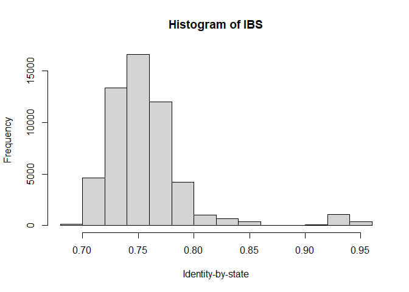

Selecting markers for pedigree verification
================
Lindsay Clark, HPCBio, Roy J. Carver Biotechnology Center, University of
Illinois, Urbana-Champaign

In this workflow, we’ll identify markers useful for identifying
accessions and verifying pedigrees, and export those markers for KASP
marker design.

## Setup

Be sure you have completed the [setup](Setup.md) steps before working
through this pipeline. First we’ll load all the needed packages and
functions.

``` r
library(VariantAnnotation)
library(Rsamtools)
library(adegenet)
library(ggplot2)
library(ape)
library(dplyr)
source("src/marker_stats.R")
source("src/getNumGeno.R")
source("src/evaluate_marker_sets.R")
```

Next we’ll point to our VCF and reference genome files. Edit these lines
to point to your dataset.

``` r
bg <- "data/331_new_data_vcf_IBRC.vcf.bgz"
rds <- "data/yam336.m2M2vsnps_missing0.9.recode.rds" # unfiltered markers; optional
refgenome <- FaFile("data/TDr96_F1_v2_PseudoChromosome.rev07.fasta")
```

## Population statistics

We’ll import all the genotypes in numeric format, indicating number of
copies of the alternative allele.

``` r
numgen <- getNumGeno(bg)
numgen[1:10,1:10]
```

    ##                 TDr2946A TDr1489A TDr2284A TDr1499A TDr1509A TDr1510A TDr3782A TDr1858C TDr1576A TDr1585A
    ## chrom_01_32840         0        0        0        0        1        0        0        0        1        0
    ## chrom_01_45700         0        1        1        0        1        0        1        0        1        1
    ## chrom_01_58956         0        0        0        1        0        1        1        0        0        1
    ## chrom_01_62865         1        1        2        1        1        1        1        1        1        1
    ## chrom_01_65124         0        1        1        0        1        1        1        0        1        1
    ## chrom_01_66753         0        0        0        0        0        1        0        0        0        0
    ## chrom_01_115638        0        0        0        0        1        0        1        0        0        0
    ## chrom_01_117893        1        1        0        1        0        0        0        0        0        0
    ## chrom_01_119536        1        0        1        0        0        1        1        2        1        1
    ## chrom_01_129906        1        0        0        1        1        0        0        1        0        0

### Check for clonal duplicates

It is good to check that there aren’t any clonal duplicates in the
dataset, as these could bias downstream analysis. We’ll calculate
identity-by-state and look at its distribution.

``` r
myIBS <- interIndividualIBS(numgen)

hist(myIBS, xlab = "Identity-by-state", main = "Histogram of IBS")
```

<!-- -->

``` r
plot(nj(1 - myIBS), type = "unrooted", show.tip.label = FALSE)
```

<!-- -->

Here it looks like the most closely related individuals are family
members, not clones. If there were some values closer to one, however,
clones could be removed using the `removeClones` function.

``` r
numgen <- removeClones(numgen, myIBS)
```

### Observed and expected heterozygosity

Let’s look at the distribution of allele frequencies in this dataset.

``` r
alfreq <- rowMeans(numgen, na.rm = TRUE) / 2
hist(alfreq, xlab = "Allele frequency", main = "Histogram of alternative allele frequency")
```

<!-- -->

We can look at the relationship between observed and expected
heterozygosity ( *Ho* and *He*, respectively).

``` r
He <- Expected_het(alfreq)
Ho <- rowMeans(numgen == 1, na.rm = TRUE)
hist(Ho / He)
```

<!-- -->

In this case the mode is a little above 1, suggesting the presence of
hybrid lines and/or polyploids in the dataset. The bump at 2 indicates
likely paralogs. In this case we’ll set a cutoff at 1.5.

``` r
hohe_cutoff <- 1.5

ggplot(mapping = aes(x = alfreq, y = Ho/He)) +
  geom_point(alpha = 0.05) +
  geom_hline(yintercept = hohe_cutoff, color = "blue") +
  labs(x = "Allele frequency") +
  ggtitle("Filtering for putative paralogs")
```

<!-- -->

We can see what proportion of markers we would lose at this cutoff. It’s
about 11%.

``` r
mean(Ho/He > hohe_cutoff)
```

    ## [1] 0.110541

We’ll do that filtering now, then start a data frame to track statistics
about each SNP.

``` r
keep1 <- which(Ho/He < hohe_cutoff)

numgen <- numgen[keep1,]
snpdf <- data.frame(row.names = rownames(numgen),
                    AlFreq = alfreq[keep1],
                    Ho = Ho[keep1],
                    He = He[keep1])
```

In this case there are no missing data, but I am going to add that
calculation in for the sake of reusing the workflow.

``` r
snpdf$MissingRate <- rowMeans(is.na(numgen))
summary(snpdf)
```

    ##      AlFreq              Ho                He          MissingRate
    ##  Min.   :0.09366   Min.   :0.03021   Min.   :0.1698   Min.   :0   
    ##  1st Qu.:0.14199   1st Qu.:0.26284   1st Qu.:0.2437   1st Qu.:0   
    ##  Median :0.20695   Median :0.35650   Median :0.3282   Median :0   
    ##  Mean   :0.24192   Mean   :0.37814   Mean   :0.3388   Mean   :0   
    ##  3rd Qu.:0.31873   3rd Qu.:0.48036   3rd Qu.:0.4343   3rd Qu.:0   
    ##  Max.   :0.50000   Max.   :0.74924   Max.   :0.5000   Max.   :0

We can also look at the heterozygosity across individuals. The two
outlier individuals we see below are likely to be polyploids or
inter-species hybrids. We’ll filter them out.

``` r
hetByInd <- colMeans(numgen == 1, na.rm = TRUE)
hist(hetByInd)
```

<!-- -->

``` r
numgen <- numgen[, hetByInd < 0.5]
```

## Genetic groups

We could simply choose markers with high allele frequency at this point,
but instead I am going to identify genetic groups first. That way, I can
test the allele frequency within each genetic group. We generally want a
variety of markers so that we have some that are variable within each
group, and some that can distinguish groups. We’ll use the Discriminant
Analysis of Principal Components (DAPC) protocol implemented in the
`adegenet` package. In order to knit this document I have to set `n.pca`
and `n.da` manually, but for your work I recommend a first pass where
they are left as `NULL` so that you can chose them based on where the
graphs plateau.

``` r
myclust <- find.clusters(t(numgen), n.pca = 100)
```

<!-- -->

Based on the BIC graph, we’ll select ten clusters.

Check the size of the groups. If it is very uneven, you may want fewer
groups.

``` r
myclust$size
```

    ##  [1] 40 39 45 28 47 33 12 24 29 32

Now perform DAPC.

``` r
mydapc <- dapc(t(numgen), grp = myclust$grp, scale = TRUE, n.pca = 50, n.da = 2)
```

``` r
scatter(mydapc, posi.da = "topright")
```

<!-- -->

Group assignments are in `mydapc$assign`. You many want to inspect some
of the more differentiated groups to see if they are biologically
meaningful.

``` r
colnames(numgen)[mydapc$assign == 9]
```

    ##  [1] "TDr2946A"   "TDr1655A"   "TDr1850A"   "TDr2674A"   "TDr2948A"   "TDr2965A"   "TDr3527A"   "TDr3624B"   "TDr3828B"   "TDr2090B"   "TDr4100A"   "TDr4180A"  
    ## [13] "TDr2262"    "TDr1717"    "TDr1763"    "TDr2502"    "TDr2674"    "TDr2965"    "TDr3408"    "TDr1905"    "TDr1928"    "TDr2048"    "TDr2564"    "TDr3006"   
    ## [25] "TDr1956"    "TDr0801090" "TDr3338"    "TDr3643"    "TDr4100"

``` r
colnames(numgen)[mydapc$assign == 4]
```

    ##  [1] "TDr1598A" "TDr1775A" "TDr1807A" "TDr2155A" "TDr2161C" "TDr2167A" "TDr2427B" "TDr2554A" "TDr4067A" "TDr3519A" "TDr1615"  "TDr1769"  "TDr1876"  "TDr2015" 
    ## [15] "TDr2028"  "TDr2110"  "TDr2681"  "TDr2973"  "TDr3519"  "TDr3579"  "TDr3592"  "TDr1958"  "TDr2249"  "TDr2297"  "TDr2355"  "TDr2974"  "TDr2975"  "TDr2859"

Now we can get allele frequencies within each genetic group.

``` r
grp_alfreq <- sapply(levels(mydapc$assign),
                     function(x) rowMeans(numgen[, mydapc$assign == x], na.rm = TRUE) / 2)
colnames(grp_alfreq) <- paste0("AlFreq_Grp", colnames(grp_alfreq))
head(grp_alfreq)
```

    ##                 AlFreq_Grp1 AlFreq_Grp2 AlFreq_Grp3 AlFreq_Grp4 AlFreq_Grp5 AlFreq_Grp6 AlFreq_Grp7 AlFreq_Grp8 AlFreq_Grp9 AlFreq_Grp10
    ## chrom_01_32840   0.36666667      0.4375  0.30000000  0.26785714   0.2448980        0.20  0.35714286     0.09375  0.24137931   0.11842105
    ## chrom_01_45700   0.61111111      0.5000  0.50000000  0.48214286   0.4081633        0.32  0.39285714     0.09375  0.27586207   0.21052632
    ## chrom_01_58956   0.05555556      0.0250  0.06666667  0.03571429   0.1938776        0.12  0.03571429     0.21875  0.15517241   0.11842105
    ## chrom_01_65124   0.62222222      0.4875  0.51111111  0.50000000   0.4081633        0.40  0.35714286     0.09375  0.27586207   0.28947368
    ## chrom_01_66753   0.07777778      0.0250  0.17777778  0.05357143   0.1224490        0.30  0.07142857     0.12500  0.01724138   0.23684211
    ## chrom_01_115638  0.36666667      0.3625  0.28888889  0.30357143   0.1938776        0.22  0.17857143     0.06250  0.24137931   0.09210526

## Technical parameters

For this portion of the workflow, we’ll import SNP metadata using the
`VariantAnnotation` package. If you are just working with one VCF, use
the following code:

``` r
myvcf <- readVcf(bg,
                 param = ScanVcfParam(geno = NA))
```

Otherwise, if you have a larger VCF, with a bigger set of markers, read
it from the RDS made during setup:

``` r
myvcf <- readRDS(rds)

rowRanges(myvcf)
```

    ## GRanges object with 6095038 ranges and 5 metadata columns:
    ##                         seqnames    ranges strand | paramRangeID            REF                ALT      QUAL      FILTER
    ##                            <Rle> <IRanges>  <Rle> |     <factor> <DNAStringSet> <DNAStringSetList> <numeric> <character>
    ##      chrom_01:32610_A/T chrom_01     32610      * |           NA              A                  T  11.38340           .
    ##      chrom_01:32612_G/T chrom_01     32612      * |           NA              G                  T   9.86092           .
    ##      chrom_01:32617_A/C chrom_01     32617      * |           NA              A                  C 352.00000           .
    ##      chrom_01:32628_C/T chrom_01     32628      * |           NA              C                  T 118.00000           .
    ##      chrom_01:32656_A/G chrom_01     32656      * |           NA              A                  G 293.00000           .
    ##                     ...      ...       ...    ... .          ...            ...                ...       ...         ...
    ##   chrom_20:33018647_T/G chrom_20  33018647      * |           NA              T                  G 999.00000           .
    ##   chrom_20:33018670_A/T chrom_20  33018670      * |           NA              A                  T 352.00000           .
    ##   chrom_20:33018687_C/G chrom_20  33018687      * |           NA              C                  G 999.00000           .
    ##   chrom_20:33018902_T/C chrom_20  33018902      * |           NA              T                  C   6.42809           .
    ##   chrom_20:33018924_C/T chrom_20  33018924      * |           NA              C                  T 999.00000           .
    ##   -------
    ##   seqinfo: 2253 sequences from an unspecified genome

Since we have quality scores, we will look at the distribution.

``` r
hist(rowRanges(myvcf)$QUAL, xlab = "Quality score",
     main = "Histogram of quality scores in large VCF")
```

<!-- -->

This suggests filtering to only keep the highest scores is advisable. We
will also make sure to keep any SNPs that were in our smaller VCF.

``` r
temp <- paste(seqnames(myvcf), start(myvcf), sep = "_")

myvcf <- myvcf[rowRanges(myvcf)$QUAL > 900 | 
                 temp %in% rownames(snpdf),]
```

### GC content

PCR tends to work best in regions that are 40-60% GC. We will test the
GC content for the 50-bp flanking region for each SNP in our table.

``` r
snpdf$GCcontent <- gcContent(myvcf, rownames(snpdf), refgenome)

hist(snpdf$GCcontent, xlab = "GC content", main = "Histogram of GC content")
```

<!-- -->

``` r
mean(snpdf$GCcontent >= 0.4 & snpdf$GCcontent <= 0.6)
```

    ## [1] 0.3651152

About 36.5% of markers are within the target range for GC content. We
can subset to just look at these.

``` r
snpdf2 <- filter(snpdf, GCcontent >= 0.4, GCcontent <= 0.6)
```

### Number of flanking SNPs

Although we’ll annotate flanking SNPs, the fewer there are, the less
likely the marker will have technical problems.

``` r
snpdf2$Nflanking <- nFlankingSNPs(myvcf, rownames(snpdf2))

hist(snpdf2$Nflanking, xlab = "Number of flanking SNPs",
     main = "Histogram of number of flanking SNPs")
```

<!-- -->

``` r
table(snpdf2$Nflanking)
```

    ## 
    ##     0     1     2     3     4     5     6     7     8     9    10    11    12    13    14    15 
    ##  5925 10224 10255  8104  5057  2576  1188   494   259   107    60    36     8     7     4     2

The cutoff is arbitrary, but let’s keep markers with two or fewer
flanking SNPs.

``` r
snpdf3 <- filter(snpdf2, Nflanking <= 2)
```

## Choosing a set of markers

Since we are selecting a small set of markers, we want to not only make
sure that each individual marker has a high minor allele frequency to
maximize its information content, but also that the markers complement
each other well so that they can distinguish individuals and genetic
groups.

Two approaches are presented here. One is a Galaxy tool developed by
Carlos Ignacio for finding sets of markers that distinguish all
accessions. The second is an algorithm I developed to maximize diversity
captured within and between genetic groups.

### Galaxy tool

First, we have to export our set of suitable markers back to VCF. Some
conversion of marker and chromosome names is done here in order to get
everything to match.

``` r
rr3 <- rowRanges(myvcf)[match(rownames(snpdf3),
                              paste(seqnames(myvcf), start(myvcf), sep = "_"))]
rr3a <- GRanges(sub("chrom", "OM", seqnames(rr3)), ranges(rr3))
subvcf <- readVcf(bg, genome = seqinfo(rr3a),
                  param = ScanVcfParam(which = rr3a))

writeVcf(subvcf, filename = "results/marker_subset.vcf")
```

Now, on Galaxy, use the [Purity
tool](http://galaxy-demo.excellenceinbreeding.org/root?tool_id=purity_beta)
on that VCF file. I set it to select 50 markers after considering 10,000
solutions, and left the distance cutoff at 0.05. Two files were output,
and I downloaded the first to my `results` folder. Below I will import
it to get the marker set.

``` r
markers_purity <- read.delim("results/Galaxy9-[Purity_(beta)_on_data_8].tabular")$Name[1:50]

sort(markers_purity)
```

    ##  [1] "chrom_01_13215574" "chrom_01_16722696" "chrom_03_8145709"  "chrom_05_1402614"  "chrom_05_15642980" "chrom_05_16166857" "chrom_05_19197424" "chrom_06_11370264"
    ##  [9] "chrom_06_1389600"  "chrom_06_16474865" "chrom_06_1721907"  "chrom_06_20333485" "chrom_07_25601418" "chrom_07_25862177" "chrom_08_14532723" "chrom_09_17245165"
    ## [17] "chrom_09_20244151" "chrom_10_23384975" "chrom_11_15371387" "chrom_11_7476286"  "chrom_12_10725268" "chrom_12_19461014" "chrom_12_19554292" "chrom_12_19646887"
    ## [25] "chrom_12_9869300"  "chrom_13_2047134"  "chrom_13_45513"    "chrom_14_8004400"  "chrom_15_13652946" "chrom_15_15308370" "chrom_15_182038"   "chrom_15_3166274" 
    ## [33] "chrom_15_3532953"  "chrom_15_3558766"  "chrom_16_11923021" "chrom_16_11941748" "chrom_16_12630527" "chrom_16_18591145" "chrom_16_22290712" "chrom_16_8905213" 
    ## [41] "chrom_17_12293584" "chrom_17_13343607" "chrom_17_19171588" "chrom_17_2594646"  "chrom_17_2672794"  "chrom_18_15163101" "chrom_18_16385238" "chrom_19_22645412"
    ## [49] "chrom_19_22953072" "chrom_20_31820360"

### Simulated annealing algorithm

In the file [evaluate\_marker\_sets.R](src/evaluate_marker_sets.R) there
is a function to use a [simulated annealing
algorithm](https://en.wikipedia.org/wiki/Simulated_annealing) to find
optimal sets of markers that capture diversity within and between
genetic groups.

``` r
markers_simanneal <- findMarkerSet(grp_alfreq[rownames(snpdf3),], nSNP = 50)$Set

sort(markers_simanneal)
```

    ##  [1] "chrom_01_27275023" "chrom_02_16909288" "chrom_02_23698309" "chrom_03_18568582" "chrom_04_10618167" "chrom_04_15150750" "chrom_04_8900737"  "chrom_05_1384592" 
    ##  [9] "chrom_05_17000860" "chrom_05_24296120" "chrom_06_10055883" "chrom_06_15349033" "chrom_06_16479684" "chrom_07_15156246" "chrom_07_29826812" "chrom_08_15408226"
    ## [17] "chrom_08_16065388" "chrom_09_6928209"  "chrom_10_10660488" "chrom_10_11528458" "chrom_10_14200449" "chrom_10_272561"   "chrom_10_482457"   "chrom_10_663980"  
    ## [25] "chrom_11_13649874" "chrom_11_2407008"  "chrom_11_6797536"  "chrom_12_19646887" "chrom_14_14921513" "chrom_14_15526286" "chrom_14_20907274" "chrom_15_11969634"
    ## [33] "chrom_15_12971805" "chrom_15_13236354" "chrom_15_14027608" "chrom_15_16810337" "chrom_15_17159846" "chrom_15_18443213" "chrom_15_18600988" "chrom_16_13058451"
    ## [41] "chrom_16_20344737" "chrom_16_21818296" "chrom_17_19787441" "chrom_17_9162321"  "chrom_17_9798706"  "chrom_18_7929814"  "chrom_19_21300319" "chrom_19_22363327"
    ## [49] "chrom_19_23929271" "chrom_19_30122820"

### Comparing the results

How well do the markers distinguish individuals in the dataset?

``` r
ibs_purity <- interIndividualIBS(numgen[markers_purity,])

hist(ibs_purity, xlab = "Identity-by-state",
     main = "Histogram of IBS using Purity marker subset")
```

<!-- -->

``` r
mean(ibs_purity == 1)
```

    ## [1] 9.26681e-05

``` r
propUnique(numgen[markers_purity,])
```

    ## [1] 0.9696049

``` r
ibs_simanneal <- interIndividualIBS(numgen[markers_simanneal,])

hist(ibs_simanneal, xlab = "Identity-by-state",
     main = "Histogram of IBS using simulated annealing marker subset")
```

<!-- -->

``` r
mean(ibs_simanneal == 1)
```

    ## [1] 0.00194603

``` r
propUnique(numgen[markers_simanneal,])
```

    ## [1] 0.7902736

If two individuals were selected at random, there is a 0.2% chance that
they would have identical genotypes across all markers using the
simulated annealing algorithm, as opposed to a 0.01% chance using
markers from the Purity algorithm. This corresponds to 75% of the
individuals being unique with the simulated annealing set and 97% of
individuals being unique with the Purity set. So, the Purity algorithm
is somewhat better for distinguishing individuals.

We can also compare the geometric mean of expected heterozygosity in all
of the populations.

``` r
DivScore(grp_alfreq[markers_purity,])
```

    ## [1] 0.2987475

``` r
DivScore(grp_alfreq[markers_simanneal,])
```

    ## [1] 0.3681497

The simulated annealing algorithm gives higher expected heterozygosity.

We can also see the geometric mean of Jost’s D, a differentiation
statistic among populations.

``` r
DiffScore(grp_alfreq[markers_purity,])
```

    ## [1] 0.0417267

``` r
DiffScore(grp_alfreq[markers_simanneal,])
```

    ## [1] 0.09835632

The simulated annealing algorithm gives higher differentiation among
populations.

## Exporting markers

Now we can get the flanking sequences for the markers that we selected.

``` r
markerseq1 <- formatKasp(myvcf, markers_purity, refgenome)
markerseq2 <- formatKasp(myvcf, markers_simanneal, refgenome)

head(markerseq1)
```

    ##              SNP_ID                                                                                                Sequence
    ## 1 chrom_01_13215574 CACCGCTAGGRGAGTTGAGTATAGAGTTCAGCAGTCCACTTCTTCGACTG[Y]TGCTTCTGAGGTACTCCMGGTAGGTGAAGATACCCCTGTCCCACCACTAA
    ## 2 chrom_01_16722696 GGTACCGATCCGACGAGCTGTATCCTAGGCCGGACAAAGGGACCCTTGGA[Y]GAGTAGAAGACTCTCCAAAAGACCATCACCACAACTATYGAGGARGTTTT
    ## 3  chrom_03_8145709 TTTGCTATTCYCGAGCACCAGGTGCATTTTGAACGTTTGTCGAGACTTTC[R]TTTCGGACATACTCGATTCCTGGACACAAGCATATTAATAGATCTACGRC
    ## 4  chrom_05_1402614 ATACCCCTGGAAGATCTAATCCAAGGGGTAGGCTGCCCATTAATAAGAAA[R]GAAAAGGAGGTGGAAGAAATACAAGCTTCTATCCAGGAGATCCAAATAGG
    ## 5 chrom_05_15642980 CAACAGAGTGATGTGTTGAAGTAATCYTTAGTGCTGGGGCTTAATTKTGA[S]TAGAGGTCTTTCACCTAGACCAAAGGGTTAGATCTATATTAGGGAATAGG
    ## 6 chrom_05_16166857 ATTCCTAAGTTGGTGGTGAATCGACCTGCTTCTCTTTTCCCTTATACTTG[Y]TTTATATGGACTCCTTCCCACTTGTTTTAGCCACCTTATGCTTCTCCGTT

These can be exported to a spreadsheet.

``` r
write.csv(markerseq1, file = "results/pedigree_verification_markers_Purity.csv",
          row.names = FALSE)
write.csv(markerseq2, file = "results/pedigree_verification_markers_simanneal.csv",
          row.names = FALSE)
```

## Curve to determine optimal number of markers

An additional analysis was performed where the number of markers in the
dataset was varied, in order to determine the optimal number of markers.

``` r
markers_purity10 <- read.delim("results/Galaxy11-[Purity_(beta)_on_data_8].tabular")$Name[1:10]
markers_purity20 <- read.delim("results/Galaxy13-[Purity_(beta)_on_data_8].tabular")$Name[1:20]
markers_purity30 <- read.delim("results/Galaxy15-[Purity_(beta)_on_data_8].tabular")$Name[1:30]
markers_purity40 <- read.delim("results/Galaxy17-[Purity_(beta)_on_data_8].tabular")$Name[1:40]
markers_purity75 <- read.delim("results/Galaxy19-[Purity_(beta)_on_data_8].tabular")$Name[1:75]
markers_purity100 <- read.delim("results/Galaxy21-[Purity_(beta)_on_data_8].tabular")$Name[1:100]

markers_purity_list <- list(markers_purity10, markers_purity20, markers_purity30, markers_purity40,
                            markers_purity, markers_purity75, markers_purity100)

curve_df_purity <- data.frame(N_markers = lengths(markers_purity_list),
                              Prop_unique = sapply(markers_purity_list,
                                                   function(x) propUnique(numgen[x,])),
                              DiffScore = sapply(markers_purity_list,
                                                    function(x) DiffScore(grp_alfreq[x,])),
                              DivScore = sapply(markers_purity_list,
                                                    function(x) DivScore(grp_alfreq[x,])))
```

``` r
set.seed(1117)
markers_simanneal_list <- lapply(c(10, 20, 30, 40, 50, 75, 100),
                                 function(x) findMarkerSet(grp_alfreq[rownames(snpdf3),], nSNP = x)$Set)

curve_df_simanneal <- data.frame(N_markers = lengths(markers_simanneal_list),
                                 Prop_unique = sapply(markers_simanneal_list,
                                                   function(x) propUnique(numgen[x,])),
                                 DiffScore = sapply(markers_simanneal_list,
                                                    function(x) DiffScore(grp_alfreq[x,])),
                                 DivScore = sapply(markers_simanneal_list,
                                                    function(x) DivScore(grp_alfreq[x,])))
save(markers_simanneal_list, curve_df_simanneal, file = "results/simanneal_curve.RData")
```

``` r
curve_df_purity$Method <- "Purity"
curve_df_simanneal$Method <- "Simulated annealing"
curve_df_comb <- rbind(curve_df_purity, curve_df_simanneal)

ggplot(curve_df_comb, aes(x = N_markers, y = Prop_unique, color = Method)) +
  geom_line()
```

<!-- -->

With 75 or 100 markers, all accessions could be distinguished using
markers selected with the Purity method. The simulated annealing method
still only distinguished 88% of accessions with 100 markers, as it was
trying to optimize diversity rather than identification of accessions.

``` r
ggplot(curve_df_comb, aes(x = N_markers, y = DiffScore, color = Method)) +
  geom_line()
```

<!-- -->

The simulated annealing algorithm was better than the Purity method at
differentiating populations. The number of markers included did not have
much of an impact on either method.

``` r
ggplot(curve_df_comb, aes(x = N_markers, y = DivScore, color = Method)) +
  geom_line()
```

<!-- -->

As the number of markers increased, the Purity method captured more
diversity within populations, although not as much as the simulated
annealing method.
