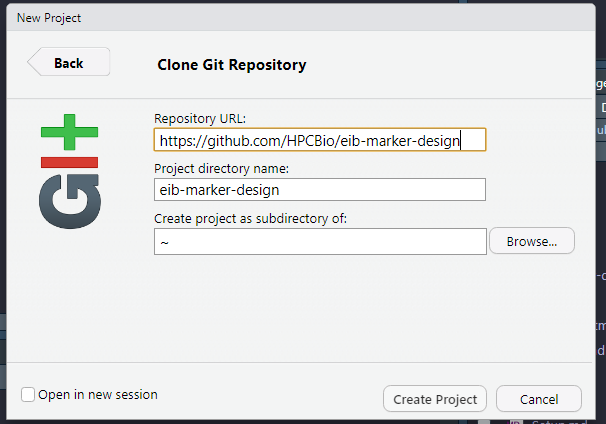

# KASP marker design for Excellence in Breeding

Workflows developed by Lindsay Clark at the Roy J. Carver Biotechnology Center
at the University of Illinois, Urbana-Champaign. Funding is through the
Excellence in Breeding program and CGIAR centers.

## Purpose

These workflows were developed to assist in KASP assay design from resequencing
data in crop species.  They can identify markers well-suited to particular tasks
(pedigree verification, marker-assisted selection) and output the markers in
a format that can be supplied directly to a vendor for KASP assay development.
Flanking sequence 50 bp to either side of the SNP is output, and other SNPs in
the region are annotated.

## Using these workflows

Each workflow is provided here in two formats.  The one ending in `.Rmd` is the
one that you will edit and use to run the code.  The one ending in `.md` is
intended to be easily readable from GitHub, and you can click on it from your
web browser to get a preview of what the workflow and results look like.

If you have a GitHub account and want to modify the workflows for use in your
species of interest, I suggest
[making your own fork](https://docs.github.com/en/github/getting-started-with-github/fork-a-repo)
of this repository.  If not,
don't worry, you can always save a copy and edit it locally!

In RStudio, go to

```
File --> New Project --> Version Control --> Git
```

If you don't see an option for Git, follow
[these instructions](https://support.rstudio.com/hc/en-us/articles/200532077?version=1.2.1335&mode=desktop)
to install it.

If you aren't making your own fork, put https://github.com/HPCBio/eib-marker-design in
the "Repository URL" box.  If you did make your own fork, put the URL for your
fork there instead.  Change the directory if you want, then click "Create Project".
If you are successful, all of the files and directories from this repository will
be copied to your computer and opened as an RStudio project.



Put your VCF and reference genome FASTA into the `data` directory.  The `results`
directory is where the output will be after you run the code.

## The workflows

* [Setup](Setup.md)
* [Choosing markers for pedigree verification](Pedigree_verification.md)
* [Choosing markers for marker-assisted selection](Marker_assisted_selection.md)
